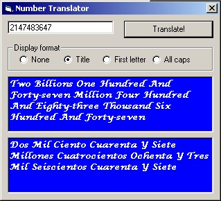



## Number to Text Up to Billions with Bonus Uppercase \(Updated\)

### Description

That's right, all positive long values up to 2147483647. This simple algorithm can translate any positive long value to its string equivalent, both English and Spanish. The principle is simple: Process three digits at a time because the cycle is repetitive every three digits. The only thing you have to append every time is the order qualifier: Thousand, Million, or Billion. The code of the main function is commented, and the other functions are just plain very easy, so no commenting there. The user interface shown here is very simple because the object of this post is the functionality! :) BONUS: Included (and made just for fun) there is a custom uppercase function. It was programmed under the principle that switching between lower and upper case, all you have to do is flip bit &H20. It also writes to the source string directly by mapping an array to the string buffer (advanced stuff). I did not benchmark, but supposedly, this upper case method should be a lot faster than regular string manipulation, although I don't know if it is faster than the VB upper case function. If you want to implement this in one of your applications, all you have to do is drop the module in. Please vote and comment.

UPDATE: Run-time error 9 in uppercase function solved. It was a silly error.
 
### More Info
 

             |
---                |---
**Submitted On**   |2002-10-12 01:28:34
**By**             |[Jose Ramirez](https://github.com/Planet-Source-Code/PSCIndex/blob/master/ByAuthor/jose-ramirez.md)
**Level**          |Beginner
**User Rating**    |4.7 (14 globes from 3 users)
**Compatibility**  |VB 4\.0 \(16\-bit\), VB 4\.0 \(32\-bit\), VB 5\.0, VB 6\.0, VB Script, VBA MS Access, VBA MS Excel
**Category**       |[String Manipulation](https://github.com/Planet-Source-Code/PSCIndex/blob/master/ByCategory/string-manipulation__1-5.md)
**World**          |[Visual Basic](https://github.com/Planet-Source-Code/PSCIndex/blob/master/ByWorld/visual-basic.md)
**Archive File**   |[Number\_to\_14490510122002\.zip](https://github.com/Planet-Source-Code/jose-ramirez-number-to-text-up-to-billions-with-bonus-uppercase-updated__1-39627/archive/master.zip)

